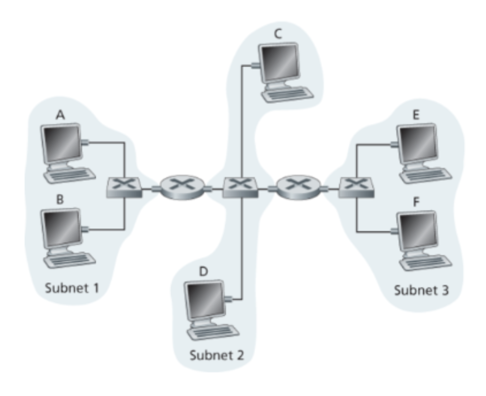

# CS 372 Assignment 4

## Robert Detjens

---

## 1. Show that the maximum efficiency of pure ALOHA is $\frac{1}{2e}$.

Suppose that at any given time the probability of a node transmitting is $p$. At the time a node wants to transmit its
frame ($t_0$), all other nodes cannot have begun their transmission at time [$t_0 - 1$ .. $t_0 + 1$]. The probability
that other nodes do not transmit in that time is $(1-p)^{2(N-1)}$. Thus, the probability that a node has a successful
transmission is $p(1-p)^{2(N-1)}$, and the probability that *any* node has a successful transmission is
$Np(1-p)^{2(N-1)}$.

To maximize $p$, a derivative is taken and set equal to 0:

$$ \frac{d}{dp}\ Np(1-p)^{2(N-1)} = N(1-p)^{2(N-1)} - 2Np(N-1)(1-p)^{2(N-1)-1} $$

$$
\begin{split}
  N(1-p)^{2(N-1)} - 2Np(N-1)(1-p)^{2(N-1)-1} &= 0 \\
  (1-p)(N(1-p)^{2(N-1)-1}) &= 2p(N-1)(N(1-p)^{2(N-1)-1}) \\
  1-p &= 2p(N-1) \\
  \frac{1}{p} - 1 &= 2(N-1) \\
  \frac{1}{p} &= 2(N-1) + 1 \\
  p_{max} &= \frac{1}{2N - 1}
\end{split}
$$

As the number of nodes increases to infinity, the probability of a successful transmit approaches:

$$
\lim_{N \to \infty} N(\frac{1}{2N - 1})(1-\frac{1}{2N - 1})^{2(N-1)} = (\lim_{N \to \infty} \frac{N}{2N-1}) (\lim_{N \to \infty} (1 - \frac{1}{2N})^{2N}) = (\frac{1}{2})(\frac{1}{e}) \bold{= \frac{1}{2e}}
$$

## 2. Consider two nodes, A and B, that use the slotted ALOHA protocol to contend for a channel. Suppose node A has more data to transmit than node B, and node As retransmission probability $p_A$ is greater than node B's retransmission probability, $p_B$.

### (a) Provide a formula for node As average throughput. What is the total efficiency of the protocol with these two nodes?

The probability that A has a successful transmit is $p_A(1 - p_B)$.
The probability that B has a successful transmit is $p_B(1 - p_A)$.

Total efficiency is $p_A(1 - p_B) + p_B(1 - p_A)$.

### (b) If $p_A=2p_B$, is node A's average throughput twice as large as that of node B? Why or why not? If not, how can you choose $p_A$ and $p_B$ to make that happen?

The probability that A has a successful transmit is $p(1 - 2p) = p - 2p^2$.
The probability that B has a successful transmit is $2p(1 - p) = 2p - 2p^2$.

$2(p - 2p^2) \ne 2p - 2p^2$, so node A does not have twice the throughput of B. In order for node A to have twice the throughput, $p_A = \frac{2p_B}{1 + p_B}$

### (c) In general, suppose there are N nodes, among which node A has retransmission probability 2p and all other nodes have retransmission probability p. Provide expressions to compute the average throughputs of node A and of any other node.

Throughput of node A: $2p(N-1)(1 - p)$

Throughput of any other node: $p(N-2)(1 - 2p)(1 - p)$

## 3. Consider a broadcast channel with N nodes and a transmission rate of R bps. Suppose the broadcast channel uses polling (with an additional polling node) for multiple access. Suppose the amount of time from when a node completes transmission until the subsequent node is permitted to transmit (that is, the polling delay) is $d_{poll}$. Suppose that within a polling round, a given node is allowed to transmit at most Q bits. What is the maximum throughput of the broadcast channel?

Throughput = $\frac{Q}{d_{poll} + \frac{Q}{R}}$

## 4. Consider three LANs interconnected by two routers, as shown in figure below.

{width=250px}

### (a) Assign IP addresses to all of the interfaces. For Subnet 1 use addresses of the form `192.168.1.xxx`; for Subnet 2 uses addresses of the form `192.168.2.xxx`; and for Subnet 3 use addresses of the form `192.168.3.xxx`.

| Machine          | IP              |
|------------------|-----------------|
| A                | `192.168.1.100` |
| B                | `192.168.1.200` |
| C                | `192.168.2.100` |
| D                | `192.168.2.200` |
| E                | `192.168.3.100` |
| F                | `192.168.3.200` |
| Left Router SN1  | `192.168.1.001` |
| Left Router SN2  | `192.168.2.001` |
| Right Router SN2 | `192.168.2.002` |
| Right Router SN3 | `192.168.3.002` |

### (b) Assign MAC addresses to all of the adapters.

| Machine          | MAC                 |
|------------------|---------------------|
| A                | `11:11:00:00:AA:AA` |
| B                | `11:11:00:00:BB:BB` |
| C                | `22:22:00:00:AA:AA` |
| D                | `22:22:00:00:BB:BB` |
| E                | `33:33:00:00:AA:AA` |
| F                | `33:33:00:00:BB:BB` |
| Left Router SN1  | `11:11:00:00:11:11` |
| Left Router SN2  | `22:22:00:00:11:11` |
| Right Router SN2 | `22:22:00:00:22:22` |
| Right Router SN3 | `33:33:00:00:22:22` |

### (c) Consider sending an IP datagram from Host E to Host B. Suppose all of the ARP tables are up to date. Enumerate all the steps.

1. E creates IP packet with source `192.168.3.100` (itself) and dest `192.168.1.200` (B).
2. E transmits Link frame containing the packet with source `33:33:00:00:AA:AA` (itself) and dest `33:33:00:00:22:22` (Right Router SN3).
3. Right router removes IP packet from frame and examines the destination IP.
4. Right router determines which interface to send the packet over.
5. Right router transmits Link frame containing the packet with source `22:22:00:00:22:22` (itself) and dest `22:22:00:00:11:11` (Left Router SN2)
6. Left router removes IP packet from frame and examines the destination IP.
7. Left router determines which interface to send the packet over.
8. Left router transmits Link frame containing the packet with source `11:11:00:00:11:11` (itself) and dest `11:11:00:00:BB:BB` (B).
9. B removes IP packet from frame and passes IP packet up the network stack.

### (d) Repeat (c), now assuming that the ARP table in the sending host is empty (and the other tables are up to date).

1. E asks using ARP for the MAC address of the gateway router `192.168.3.002`
2. Right Router responds with its MAC address `33:33:00:00:22:22`
3. E creates IP packet with source `192.168.3.100` (itself) and dest `192.168.1.200` (B).
4. E transmits Link frame containing the packet with source `33:33:00:00:AA:AA` (itself) and dest `33:33:00:00:22:22` (Right Router SN3).
5. Right router removes IP packet from frame and examines the destination IP.
6. Right router determines which interface to send the packet over.
7. Right router transmits Link frame containing the packet with source `22:22:00:00:22:22` (itself) and dest `22:22:00:00:11:11` (Left Router SN2)
8. Left router removes IP packet from frame and examines the destination IP.
9. Left router determines which interface to send the packet over.
10. Left router transmits Link frame containing the packet with source `11:11:00:00:11:11` (itself) and dest `11:11:00:00:BB:BB` (B).
11. B removes IP packet from frame and passes IP packet up the network stack.

## 5. In this problem, you will derive the efficiency of a CSMA/CD-like multiple access protocol. In this protocol, time is slotted and all adapters are synchronized to the slots. Unlike slotted ALOHA, however, the length of a slot (in seconds) is much less than a frame time (the time to transmit a frame). Let S be the length of a slot. Suppose all frames are of constant length L=kRS, where R is the transmission rate of the channel and k is a large integer. Suppose there are N nodes, each with an infinite number of frames to send. We also assume that $d_{prop} < S$, so that all nodes can detect a collision before the end of a slot time. The protocol is as follows:

- If, for a given slot, no node has possession of the channel, all nodes contend for the channel; in particular,each node transmits in the slot with probability p. If exactly one node transmits in the slot, that node takes possession of the channel for the subsequent k1 slots and transmits its entire frame.
- If some node has possession of the channel, all other nodes refrain from transmitting until the node that possesses the channel has finished transmitting its frame. Once this node has transmitted its frame, all nodes contend for the channel. Note that the channel alternates between two states: the productive state, which lasts exactly k slots, and the nonproductive state, which lasts for a random number of slots. Clearly, the channel efficiency is the ratio of $\frac{k}{k+x}$, where x is the expected number of consecutive unproductive slots.

### (a) For fixed N and p, determine the efficiency of this protocol.

### (b) For fixed N, determine the p that maximizes the efficiency.

### (c) Using the p (which is a function of N) found in (b), determine the efficiency as N approaches infinity.

### (d) Show that this efficiency approaches 1 as the frame length becomes large.

## 6. Consider the figure in Problem 4 above (P14, Page 510). Provide MAC addresses and IP addresses for the interfaces at Host A, both routers, and Host F. Suppose Host A sends a datagram to Host F.

| Machine          | IP              | MAC                 |
|------------------|-----------------|---------------------|
| A                | `192.168.1.100` | `11:11:00:00:AA:AA` |
| Left Router SN1  | `192.168.1.001` | `11:11:00:00:11:11` |
| Left Router SN2  | `192.168.2.001` | `22:22:00:00:11:11` |
| Right Router SN2 | `192.168.2.002` | `22:22:00:00:22:22` |
| Right Router SN3 | `192.168.3.002` | `33:33:00:00:22:22` |
| F                | `192.168.3.200` | `33:33:00:00:BB:BB` |

### (a) Give the source and destination MAC addresses in the frame encapsulating this IP datagram as the frame is transmitted from A to the left router. Give the source and destination IP addresses in the IP datagram encapsulated within the frame in this scenario.

IP packet source / dest: `192.168.1.100` / `192.168.3.200`

Link frame source / dest: `11:11:00:00:AA:AA` / `11:11:00:00:11:11`

### (b) Give the source and destination MAC addresses in the frame encapsulating this IP datagram as the frame is transmitted from the left router to the right router. Give the source and destination IP addresses in the IP datagram encapsulated within the frame in this scenario.

IP packet source / dest: `192.168.1.100` / `192.168.3.200`

Link frame source / dest: `22:22:00:00:11:11` / `22:22:00:00:22:22`

### (c) Give the source and destination MAC addresses in the frame encapsulating this IP datagram as the frame is transmitted from the right router to F. Give the source and destination IP addresses in the IP datagram encapsulated within the frame in this scenario.

IP packet source / dest: `192.168.1.100` / `192.168.3.200`

Link frame source / dest: `33:33:00:00:22:22` / `33:33:00:00:BB:BB`

## 7. Suppose the distance between two ends of an Ethernet LAN with a transmission rate of R bps is d meters. Can you derive a formula to find the minimum frame size, L, needed for an Ethernet packet? Using this formula, what is the minimum required packet size for an Ethernet that spans 3 kilometers? Assume the speed of propagation is $1.8*10^8m/s$ and R=10 Mbps.

$$
L = \frac{Rd}{S_{prop}} = \frac{(10*10^6)(3000)}{1.8*10^8} = 166.66 = \bold{167\ bits}
$$

## 8. Suppose two nodes, A and B, are attached to opposite ends of an 800 m cable, and that they each have one frame of 1,500 bits (including all headers and preambles) to send to each other. Both nodes attempt to transmit at time $t=0$. Suppose there are four repeaters between A and B, each inserting a 20-bit delay. Assume the transmission rate is 100 Mbps, and CSMA/CD with back off intervals of multiples of 512 bits is used. After the first collision, A draws K=0 and B draws K=1 in the exponential back off protocol. Ignore the jam signal and the 96-bit time delay.

### (a) What is the one-way propagation delay (including repeater delays) between A and B in seconds? Assume that the signal propagation speed is $2*10^8m/sec$.

(Assuming `2.10^8` was an error and `2*10^8` is correct)

$$
d_{prop} = \frac{800\ m}{2*10^8\ \frac{m}{s}} + 4(\frac{20\ b}{100*10^6\ \frac{b}{s}}) = \bold{4.8*10^{-6}\ s}
$$

### (b) At what time (in seconds) is As frame completely delivered at B?

$$
\begin{split}
  t_{delivered} &= d_{prop} + d_{prop} + d_{backoff} + d_{transmit} + d_{prop} \\
  &= 4.8*10^{-6} + 4.8*10^{-6} + 0 + \frac{1500}{100*10^6} + 4.8*10^{-6} \\
  &= \bold{0.0000294\ s}
\end{split}
$$

### (c) Now suppose that the repeaters are replaced with switches/routers. That is, each switch incurs a store-and-forward delay in addition to the 20-bit time delay. Also, suppose that only A has a frame to send to B (that is, no collision). At what time, in seconds, is As frame delivered at B? Note that since no collision, we are calculating the delay for the first and only one frame.

$$
\begin{split}
  t_{delivered} &= 5d_{transmit} + d_{prop} \\
  &= 5(\frac{1500}{100*10^6}) + 4.8*10^{-6} \\
  &= \bold{0.0000798\ s}
\end{split}
$$
