# CS 372 Lab 3

## Robert Detjens

*Note: the given trace was used for all questions*

---

Answer the following questions based on the contents of the Ethernet frame containing the HTTP GET message.

### 1. What is the 48-bit Ethernet address of your computer?

`00:d0:59:a9:3d:68`.

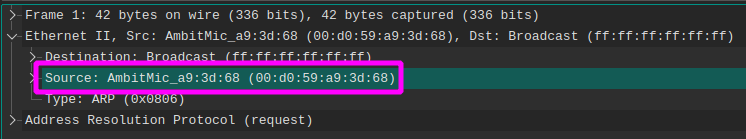{ width=600px }

### 2. What is the 48-bit destination address in the Ethernet frame? Is this the Ethernet address of `gaia.cs.umass.edu`? (Hint: the answer is no). What device has this as its Ethernet address?

`00:06:25:da:af:73`. This is the address of the first-hop router.

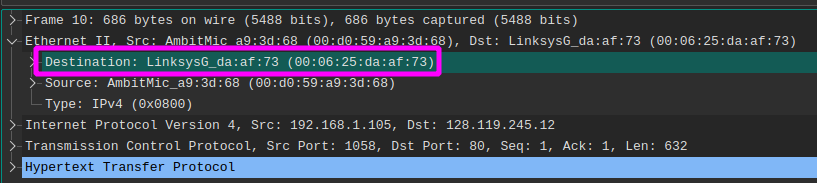{ width=600px }

### 3. Give the hexadecimal value for the two-byte Frame type field. What upper layer protocol does this correspond to?

`0x0800` (IPv4).

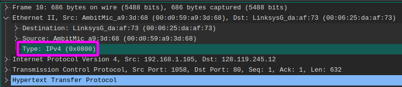{ width=600px }

### 4. How many bytes from the very start of the Ethernet frame does the ASCII "G" in "GET" appear in the Ethernet frame?

54 bytes (`0x36`).

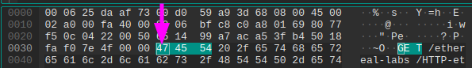{ width=600px }

---

Answer the following questions based on the contents of the Ethernet frame containing the first byte of the HTTP response message.

### 5. What is the value of the Ethernet source address? Is this the address of your computer, or of `gaia.cs.umass.edu` (Hint: the answer is no). What device has this as its Ethernet address?

`00:06:25:da:af:73`. This is the address of the first-hop router.

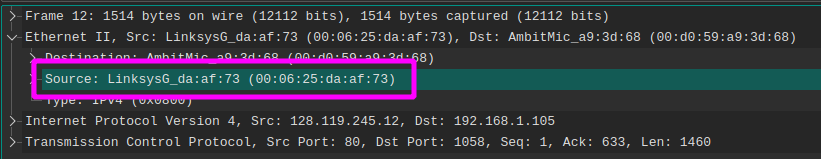{ width=600px }

### 6. What is the destination address in the Ethernet frame? Is this the Ethernet address of your computer?

`00:d0:59:a9:3d:68`.

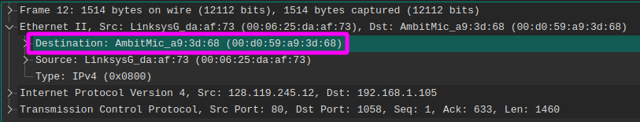{ width=600px }

### 7. Give the hexadecimal value for the two-byte Frame type field. What upper layer protocol does this correspond to?

`0x0800` (IPv4).

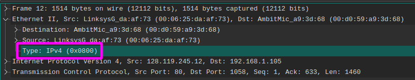{ width=600px }

### 8. How many bytes from the very start of the Ethernet frame does the ASCII "O" in "OK" (i.e., the HTTP response code) appear in the Ethernet frame?

67 bytes (`0x43`).

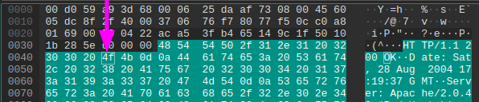{ width=600px }

---

Use the `arp` command to examine your computer's ARP cache.

### 9. Write down the contents of your computer’s ARP cache. What is the meaning of each column value?

```
Address                  HWtype  HWaddress           Flags Mask            Iface
192.168.0.100            ether   94:65:2d:c7:50:44   C                     eno1
192.168.0.1              ether   98:da:c4:7b:f5:41   C                     eno1
192.168.0.62             ether   64:00:6a:09:74:03   C                     eno1
192.168.0.69             ether   b8:27:eb:07:d5:70   C                     eno1
```

`Address` is the IP address of the node.
`HWtype` is the connection type between the host computer and the node.
`HWaddress` is the MAC address of the node.
`Flags Mask` signifies the type of entry: `C` (complete), `M` (permanent), or `P` (partial).
`Iface` is the network interface name for the connection between the host and the node.

---

Answer the following questions after recording the ARP traffic.

### 10. What are the hexadecimal values for the source and destination addresses in the Ethernet frame containing the ARP request message?

Source: `00:d0:59:a9:3d:68`.

Dest: `ff:ff:ff:ff:ff:ff`.

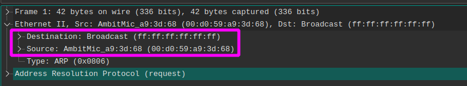{ width=600px }

### 11. Give the hexadecimal value for the two-byte Ethernet Frame type field.  What upper layer protocol does this correspond to?

`0x0806` (ARP).

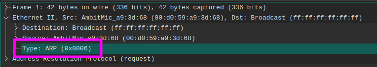{ width=600px }

### 12. Download the ARP specification.

#### a. How many bytes from the very beginning of the Ethernet frame does the ARP opcode field begin?

20 bytes in: 14 bytes for the Ethernet header + 6 bytes from the start of the ARP packet.

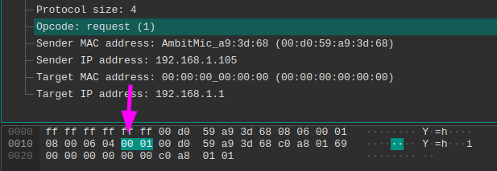{ width=600px }

#### b. What is the value of the opcode field within the ARP-payload part of the Ethernet frame in which an ARP request is made?

Opcode is `1` for a request.

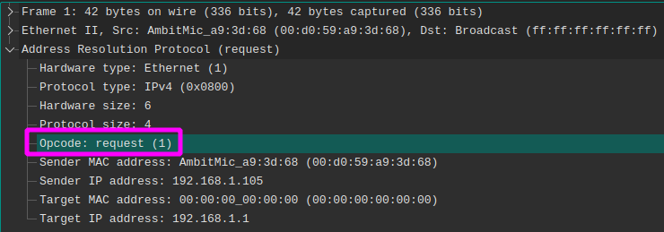{ width=600px }

#### c. Does the ARP message contain the IP address of the sender?

Yes.

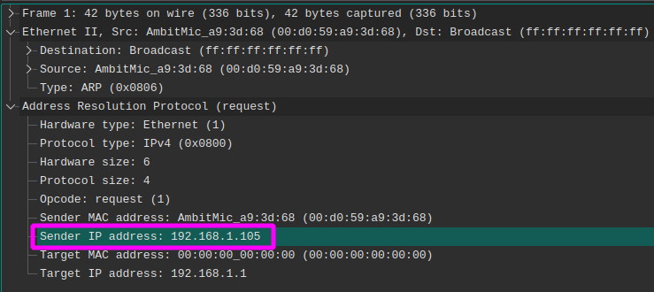{ width=600px }

#### d. Where in the ARP request does the "question" appear -- the Ethernet address of the machine whose corresponding IP address is being queried?

At byte 32 (`0x20`) (or 18 bytes into the ARP packet) .

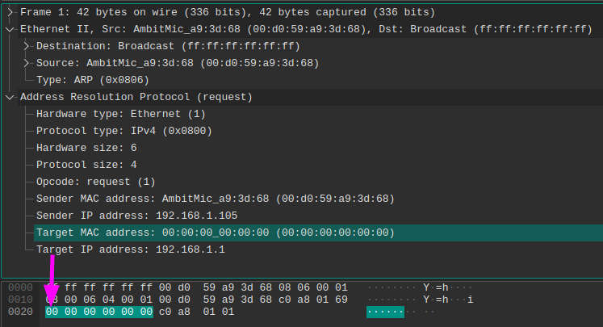{ width=600px }

### 13. Find the ARP reply that was sent in response to the ARP request.

#### a. How many bytes from the very beginning of the Ethernet frame does the ARP opcode field begin?

20 bytes in: 14 bytes for the Ethernet header + 6 bytes from the start of the ARP packet.

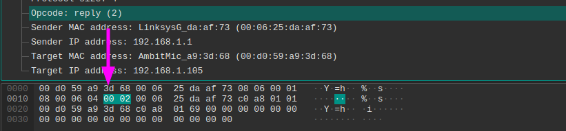{ width=600px }

#### b. What is the value of the opcode field within the ARP-payload part of the Ethernet frame in which an ARP response is made?

Opcode is `2` for a response.

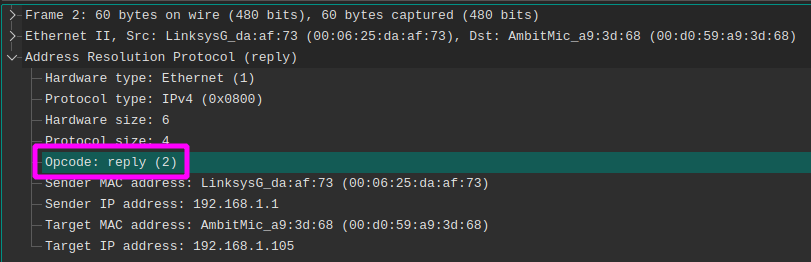{ width=600px }


#### c. Where in the ARP message does the "answer" to the earlier ARP request appear -- the IP address of the machine having the Ethernet address whose corresponding IP address is being queried?

At byte 28 (`0x1E`) (or 14 bytes into the ARP packet) .

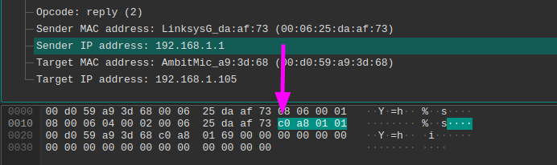{ width=600px }

### 14. What are the hexadecimal values for the source and destination addresses in the Ethernet frame containing the ARP reply message?

Source: `00:06:25:da:af:73`.

Dest: `00:d0:59:a9:3d:68`.

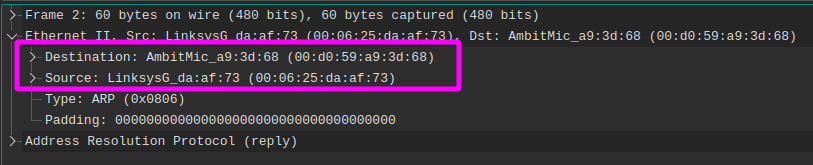{ width=600px }

### 15. In the given `ethernet-ethereal-trace-1` trace, why is there no ARP reply sent in response to the ARP request in packet 6?

ARP replies are not broadcasted and are only sent to the requesting address.
