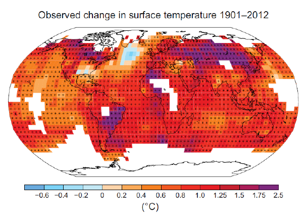

# GEO 308 Final

## Robert Detjens

---

### 1. The oldest continental rocks are over 4 billion years old, the oldest oceanic crust only around 350 million. Explain the difference.

Oceanic tectonic plates (and by extension oceanic crust) are constantly being created and destroyed through subduction where the plates meet. Continental crust does not sublimate, and as such stay around and become much older. Oceanic crust is denser than continental crust which forces the oceanic to sink into the mantle and sublimate where plates meet.

### 2. Read the article "Slowdown in plate tectonics may have led to ice sheets", which is in the reading materials for week 6 on canvas. Based on your understanding of the carbon cycle on tectonic time scales, explain why a slowdown of plate subduction could lead to a reduction in atmospheric CO2.

The sublimation of oceanic crust causes volcanic activity on the above continental plate. By slowing down subduction, volcanism (and the CO2 emissions caused by it) is reduced. Chemical weathering continues to sequester carbon into the ocean, but as there is less volcanism to replace it, the overall carbon in the atmosphere shrinks.

### 3. Carbon Capture and Storage (CCS) is a technique in which the CO2 produced by burning fuels is captured, and then stored in a secure long-term underground storage location, such as depleted oil and gas fields. CCS can be used both with fossil fuels and biofuels. A biofuel is a fuel derived from living matter, such as for example wood or vegetable oil.

A) Which carbon cycle reservoirs are involved when we apply CCS to fossil fuels? List them through time, going from the initial to the final reservoir.

    ```
    Vegetation
      --(dinosaurs died)->
    Soils
      --(decomposed into fossil fuels)->
        (..time..)
    Rocks/sediment
      --(extracted and burned)->
    Atmosphere
      --(captured and stored)->
    Rocks/sediment
    ```

B) Which carbon cycle reservoirs are involved when we apply CCS to biofuels? List them through time, going from the initial to the final reservoir.

    ```
    Vegetation
      --(turned into biofuel and burned)->
    Atmosphere
      --(captured and stored)->
    Rocks/sediment
    ```

C) Per ton of carbon, which of these two options (CCS with fossil fuel or CCS with biofuel) does more to limit atmospheric CO2 concentrations? Explain.

    Biofuel. Instead of putting carbon from the ground just to reintroduce it, biofuel takes carbon from the biosphere allowing it (assuming replantation) to sequester more carbon.

### 4. Explain the process of chemical weathering, and how it removes carbon from the atmosphere and stores it in ocean sediments.

Carbon in the atmosphere combines with water to form acidic rain, dissolving silicates and bringing them to the ocean. This sediment precipitates out and becomes part of the seafloor, eventually sublimating into the mantle.

### 5. Describe the steps that led to the ending of Snowball Earth.

Rainfall and silicate weathering stops once the planet is covered in ice, slowing and stopping the trapping of CO2. Volcanoes continue to release carbon into the atmosphere, and once enough carbon is present to cause global warming all of the ice melts and the world becomes warmer.

### 6. Explain why changes in oxygen isotopes ($\delta^{18}O$) in the ocean reflect changes in the amount of ice on land.

Ice is made up of primarily $\delta^{16}$, as the lighter isotope evaporates more easily; $\delta^{18}$ stays behind in the ocean. As more ice forms and more $\delta^{16}$ no longer makes its way back into the ocean, the water becomes more depleted.

### 7. Changes in Earth's orbit cause the Ice Ages. When the obliquity (or tilt) of the Earth is small (all else being equal), will the ice sheets in the Northern Hemisphere grow or shrink? Explain.

Tilt is responsible for the seasons. A smaller tilt begets weaker summers, and if the summer is cooler ice will not melt as much (or at all). Thus, the ice sheets will grow.

### 8. AMOC is an acronym of an important ocean current. What is the full name of this current?

Atlantic Meridional Overturning Circulation. Hot water from the south Atlantic is transported up to Greenland and the Nordic seas, and cold water from there returns back to the south Atlantic.

### 9. What does attribution mean, in the context of climate change?

Attribution with regard to climate change is deriving whether a warming trend is due to human causes or a natural occurrance.

### 10. List the two main causes of sea level rise during the last century.

- Thermal expansion of water -- as water warms up, it gets slightly larger.
- Ice sheet / glacial melting -- warmer temperatures melt ice sheets and glaciers, releasing that water into the ocean.

### 11. What do we mean by the social cost of carbon?

The social cost of carbon is the total monetary value of all damages caused by releasing another ton of carbon into the atmosphere.

$\pagebreak$

### 12. The figure below is taken from the IPCC summary for policymakers (Figure SPM 1B). It shows a map of the observed change in surface temperature between 1901 to 2012. Parts that are marked in white do not have enough temperature measurements to calculate a trend. From the data, it is clear that the North Atlantic is not warming, but in fact cooling. Scientists believe this may be due to the slowdown of the AMOC current. Explain why an AMOC slowdown would result in cooling of the North Atlantic.



The AMOC carries warmer water from the south Atlantic to Greenland and the Nordic sea to replace cold, dense water released from glacial melting. If the AMOC slows down, less warm water is brought up and the glacial runoff stays in the north Atlantic and keeps it cool.
